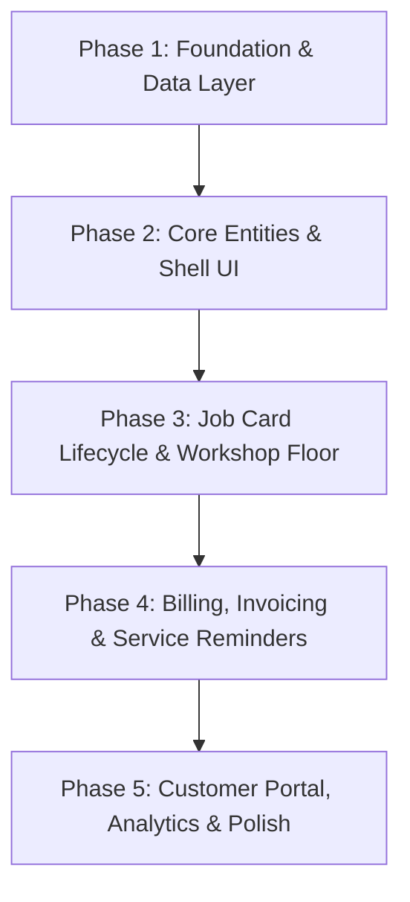

# MechWise WMS — Incremental Implementation Plan

## Executive Overview
**MechWise** is a multi-tenant SaaS Workshop Management System (WMS) built specifically for Australian mechanical workshops (launch client: **Dhalla Automotive Pty Ltd**).

This plan breaks down the development process into 5 manageable, incremental phases. Each phase culminates in verifiable functionality so the application remains operable at every step.

---

## Key Architecture & Business Requirements
- **Tech Stack:** Next.js 14 (App Router), TypeScript, Tailwind CSS, shadcn/ui, Prisma 5, PostgreSQL, JWT Auth (`jose`).
- **Brand Palette:** Primary Navy (`#1B2A4A`), Navy Light (`#243656`), Accent Amber (`#E8920D`), Amber Light (`#FDF4E3`), Background (`#F3F5F7`).
- **Typography & Formatting:** Monospace (`JetBrains Mono`) for Regos, VINs, Invoice/Job Card IDs, prices, ABNs, and phone numbers. Australian locale (`DD/MM/YYYY`, AUD `$`, Australia/Sydney timezone).
- **Core Compliance Rules:**
  - Multi-tenant isolation: Every query/mutation strictly scoped by `workshopId`.
  - Sequential Invoicing: ATO strict requirement — **NO GAPS** in `invoiceNumber` sequences. Voided invoices preserve their ID.
  - Australian GST & BAS: Prices stored ex-GST; calculate GST at line level ($amount \times 0.10$); BAS quarterly alignment (Q1=Jul–Sep).
  - ACMA SMS Compliance: Opt-out header ("Reply STOP to opt out"), 9 AM – 8 PM window.
  - Pink Slip Certification: Restrict pink slip completion to `isMvrlCertified` staff.

---

## Incremental Development Phases

---

### Phase 1: Foundation & Data Layer
**Goal:** Initialize the Next.js project, database schema, authentication, and seed baseline workshop data.

1. **Project Initialization**
   - Initialize Next.js 14 App Router project with TypeScript, Tailwind CSS, and shadcn/ui components.
   - Configure color tokens in `tailwind.config.js` and global CSS (Navy `#1B2A4A`, Amber `#E8920D`, etc.).
2. **Database & Schema Setup**
   - Define full multi-tenant Prisma schema (`Workshop`, `User`, `Staff`, `Client`, `Vehicle`, `ClientVehicle`, `JobCard`, `Invoice`, `Part`, `Payment`, `ServiceReminder`, `LedgerEntry`, etc.).
   - Configure PostgreSQL database connection and run Prisma migrations.
3. **Database Seeding (`seed.ts`)**
   - Seed Dhalla Automotive Pty Ltd (ABN 95611566888, Kingswood NSW).
   - Seed staff (Tinku Dhalla, Baljit, Harman, Ash, Manveer), 4 bays, sample clients, vehicles, job categories/jobs, parts, and suppliers.
4. **Authentication & Session Middleware**
   - Implement JWT authentication with `jose` using httpOnly cookies.
   - Add middleware for route protection and session context injection (`workshopId`, `userId`, `role`).

---

### Phase 2: Core Entities & Shell UI
**Goal:** Build the main application shell and management interfaces for Clients and Vehicles.

1. **Layout Shell**
   - Collapsible 220px Navy sidebar (`#1B2A4A`) with MECHWISE logo, navigation links, active badge counts, and user profile drawer.
   - Top bar: global search (rego/client/invoice lookup), amber "+ New Job" CTA, notification bell, date widget.
2. **Clients Module (`/clients`)**
   - Clients list with search, filter (Individual vs Business), and pagination.
   - Client create/edit drawer with ABN validation for business clients.
   - Client Detail View (`/clients/[id]`): contact details, registered vehicles, overall spend metrics, and activity notes.
3. **Vehicles Module (`/vehicles`)**
   - Rego-first lookup UI with monospace visual emphasis.
   - Link vehicles to clients via `ClientVehicle` junction model.
   - Service tracker indicators (Next Service Due date/km, Pink Slip expiry).

---

### Phase 3: Job Card Lifecycle & Workshop Floor
**Goal:** Implement the workshop's core operational engine — managing jobs from booking to completion.

1. **Job Cards Management (`/jobs`)**
   - Job Card list with status filters (`Booked`, `Waiting`, `InProgress`, `WaitingForParts`, `QC`, `ReadyForPickup`, `Completed`, `Cancelled`).
   - Create Job Card modal: client & vehicle selection, assigned mechanic, assigned bay, priority, mileage in.
2. **Interactive Job Card Screen (`/jobs/[id]`)**
   - 7-step interactive lifecycle progress bar.
   - Work items checklist: line items, estimated vs actual labour hours, part attachments, and real-time total pricing calculations.
   - Financial breakdown card (Subtotal ex-GST, GST amount, Total inc-GST).
3. **Automated Completion Pipeline**
   - Trigger execution upon setting status to `Completed`:
     1. Deduct part inventory levels automatically.
     2. Auto-generate sequential draft `Invoice`.
     3. Create `MaintenanceHistory` entry for vehicle.
     4. Calculate & schedule next `ServiceReminder`.
     5. Update vehicle current mileage (`currentMileageKm`).
4. **Workshop Floor Board (Dashboard Integration)**
   - Kanban-style bay overview (4 bays) showing active vehicle rego, mechanic, job status, and progress bar.

---

### Phase 4: Billing, Invoicing & Service Reminders
**Goal:** Complete financial workflows, payment collection, ATO-compliant invoicing, and automated SMS reminders.

1. **Invoicing Engine (`/invoices`)**
   - Invoice list and detail page (`/invoices/[id]`).
   - ATO gapless sequential numbering generator using database transaction locks.
   - PDF Generation via `@react-pdf/renderer` matching Australian Tax Invoice requirements (Workshop ABN, MVRL, ARC, breakdown of GST).
2. **Payment Processing**
   - Record payment modal with multiple methods (Cash, Credit Card, EFTPOS, PayID, Bank Transfer, BPay).
   - Instant invoice status update (`Unpaid` $\rightarrow$ `Partial` $\rightarrow$ `Paid`).
3. **Service & Pink Slip Reminders (`/reminders`)**
   - Automated rule engine for service due (6 months / 10,000 km) and Pink Slip (60 days prior to expiry).
   - Reminders dashboard with KPI tiles and filter tabs (`Due Soon`, `Overdue`, `Booked`).
   - ACMA-compliant SMS batch sender simulation (9 AM – 8 PM window check, opt-out footer).

---

### Phase 5: Customer Portal, Analytics & Polish
**Goal:** Deliver customer self-service portal, executive financial reporting, and final application polish.

1. **Customer Portal (`/portal/[token]`)**
   - Clean, lightweight branded layout without sidebar.
   - Magic link token authentication for clients.
   - Vehicle health dashboard, past invoice PDF downloads, and online booking widget.
2. **Reports & Financial Dashboard (`/reports`)**
   - Date range / BAS period selector (e.g., "Q1 2025-26").
   - KPI metric cards: Revenue, Expenses, Net Profit, Average Invoice value.
   - Visual charts (Recharts): Revenue vs Expenses bar chart, Service Type distribution pie chart.
   - Staff/mechanic efficiency table and CSV export.
3. **Dashboard & Settings Finalization**
   - Comprehensive Dashboard (`/dashboard`) combining KPI cards, workshop floor board, today's schedule, action alerts, and monthly target chart.
   - Settings page (`/settings`): business details, MVRL/ARC numbers, labour rates, SMS templates, user roles & permissions matrix.
4. **End-to-End Verification & User Walkthrough**
   - Run complete end-to-end user workflows.
   - Compile final `walkthrough.md` artifact.

---

## Verification & Quality Assurance Plan

### Automated Tests
- Database integrity & Prisma schema validation (`npx prisma validate`).
- Seed script verification to ensure Dhalla Automotive data populates cleanly.
- API route tests for multi-tenant isolation (`workshopId` injection).
- Production build validation (`npm run build`).

### Manual Verification Scenarios
1. **Rego Lookup:** Verify searching a registration number (e.g. `DL88AA`) brings up vehicle and owner instantly.
2. **Job Lifecycle to Invoice:** Progress a job card through all 7 states, verify auto-generated tax invoice, verify no gap in invoice numbers.
3. **GST & Totals:** Check line item GST ($100 \text{ ex-GST} \rightarrow \$10 \text{ GST} \rightarrow \$110 \text{ total}$).
4. **Pink Slip Gatekeeping:** Confirm non-certified mechanics cannot mark pink slip jobs as complete.
5. **Mobile & Screen Responsiveness:** Verify sidebar collapsing and table scaling on tablet/mobile viewports.

---

## Open Questions for Review
1. Should SMS notifications be integrated with a live provider (e.g. Twilio) from Phase 4, or simulated locally first?
2. Are there any specific accounting integration requirements for MVP (e.g. Xero or MYOB export format)?
